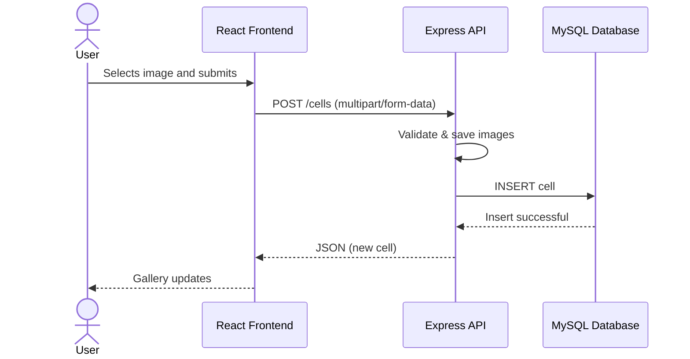
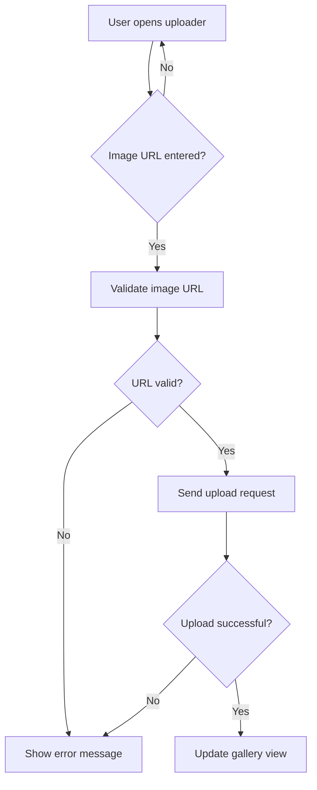
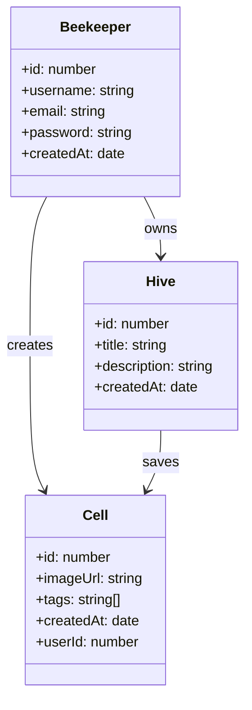

# UML – HoneyComb

## Sequence Diagram: Upload Cell

---
The interaction between the user, frontend, backend, and database when a cell (image) is uploaded 
  

## Activity Diagram: UpLoader Component Logic

---
The internal flow of the uploader component when an image URL is submitted
  

## Class Diagram: Frontend Domain Model

---
The main classes in the application and their relationships